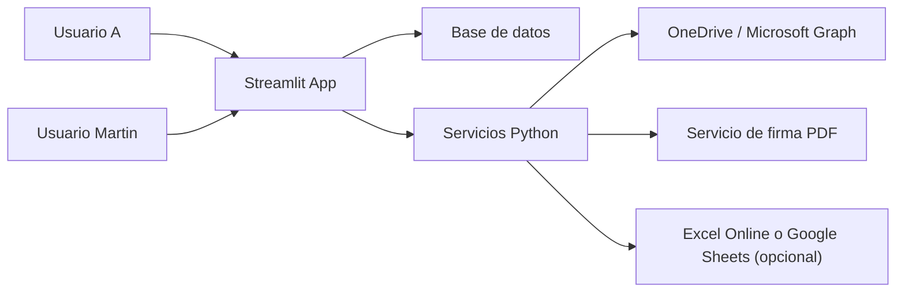

# Arquitectura Propuesta: Streamlit + OneDrive + Registro Operativo

## Objetivo

Migrar SDGF desde una app de escritorio local a una arquitectura web ligera con `Streamlit`, manteniendo el flujo operativo entre dos perfiles:

- `A`: carga PDF sin firmar a una carpeta de entrada.
- `Martin`: visualiza documentos pendientes, decide `firmar` o `rechazar`, y se registra la acción.
- Cuando Martin firma, el PDF se mueve o copia a una carpeta de salida.
- `A` ve en su panel el estado actualizado como `firmado` o `rechazado`.

La solución debe poder probarse primero con `OneDrive API` en la laptop corporativa.

---

## Recomendación Principal

Usar esta arquitectura:

- `Frontend`: Streamlit
- `Base principal`: SQLite para MVP local o PostgreSQL/Supabase para versión estable
- `Almacenamiento de PDFs`: OneDrive/SharePoint vía Microsoft Graph API
- `Registro operativo`: Excel Online o Google Sheets como espejo opcional
- `Lógica de negocio`: servicios Python separados del frontend

### Opinión técnica

`OneDrive` debe ser el almacenamiento de archivos, no la base de datos.

`Excel` o `Google Sheets` deben ser un registro auxiliar o reporte, no la fuente única de verdad.

La fuente de verdad debe ser una base de datos real con estados y auditoría.

---

## Flujo Funcional

### Perfil A

1. Ingresa a Streamlit.
2. Ve su bandeja de documentos enviados.
3. Carga un PDF.
4. El sistema sube el archivo a `OneDrive:/SDGF/entrada/`.
5. El sistema registra el documento en base de datos con estado `enviado`.
6. A ve el documento en su lista con trazabilidad.

### Perfil Martin

1. Ingresa a Streamlit.
2. Ve la bandeja de documentos pendientes.
3. Selecciona un PDF.
4. Decide:
   - `Firmar`
   - `Rechazar`
5. Si firma:
   - se descarga temporalmente el PDF;
   - se aplica la firma visual y/o digital;
   - se sube el resultado a `OneDrive:/SDGF/firmados/`;
   - se actualiza el estado a `firmado`.
6. Si rechaza:
   - se registra motivo;
   - se actualiza el estado a `rechazado`.

### Retorno a A

1. A entra a su panel.
2. El sistema consulta la base de datos.
3. La lista ya refleja si el documento fue `firmado`, `rechazado` o sigue `pendiente`.
4. Si está firmado, A puede abrir el archivo desde la carpeta `firmados`.

---

## Arquitectura Lógica



### Separación recomendada

- `Streamlit` solo presenta vistas y captura acciones.
- Los módulos `services/` hacen:
  - subida a OneDrive
  - lectura de carpetas
  - firma
  - actualización de estados
  - registro en Excel/Sheets

Esto evita que la UI concentre toda la lógica.

---

## Estructura de Carpetas en OneDrive

Propuesta inicial:

```text
/SDGF/
  /entrada/
  /firmados/
  /rechazados/
  /backup/
```

### Uso

- `entrada/`: A sube los PDFs por firmar.
- `firmados/`: salida final de documentos firmados.
- `rechazados/`: opcional para mantener PDFs rechazados con trazabilidad.
- `backup/`: opcional para copias intermedias o versiones auditables.

### Convención de nombres

- Original: `contrato_001.pdf`
- Firmado: `contrato_001_firmado.pdf`
- Rechazado: `contrato_001_rechazado.pdf` o mantener el original y registrar el estado solo en DB

---

## Modelo de Datos Recomendado

Tabla `documentos`

- `id`
- `nombre_archivo`
- `drive_file_id_entrada`
- `drive_file_id_salida`
- `ruta_entrada`
- `ruta_salida`
- `estado`
- `creado_por`
- `asignado_a`
- `fecha_envio`
- `fecha_decision`
- `motivo_rechazo`
- `requiere_firma_digital`
- `hash_archivo`
- `observaciones`

Estados sugeridos:

- `enviado`
- `pendiente_revision`
- `firmado`
- `rechazado`
- `error_firma`

Tabla `historial`

- `id`
- `documento_id`
- `accion`
- `usuario`
- `fecha`
- `detalle`

Tabla `usuarios`

- `id`
- `username`
- `nombre`
- `rol`
- `email`
- `activo`

Roles mínimos:

- `emisor`
- `firmante`

---

## Perfiles y Acceso

Para el caso de mañana, no necesitas resolver todavía SSO corporativo completo.

### MVP recomendado

Definir dos usuarios lógicos:

- `a`
- `martin`

y un selector de perfil o login simple con contraseña local.

### Versión corporativa futura

Migrar a autenticación con Microsoft:

- Azure AD / Entra ID
- login corporativo
- roles por correo o grupo

---

## Opciones de Integración con OneDrive

## Opción 1: OneDrive/SharePoint vía Microsoft Graph API

Es la mejor opción si la empresa usa Microsoft 365.

Permite:

- listar archivos en carpeta;
- subir PDFs;
- descargar PDFs;
- mover o copiar archivos entre carpetas;
- usar permisos por usuario;
- integrarse luego con Excel Online.

### Ventajas

- mejor encaje corporativo;
- autenticación centralizada;
- buena trazabilidad;
- menos dependencia de sincronización local.

### Riesgos

- permisos corporativos pueden requerir aprobación TI;
- algunas organizaciones bloquean scopes de Graph;
- puede haber diferencias entre OneDrive personal y SharePoint corporativo.

---

## Opción 2: Carpeta sincronizada local de OneDrive

La laptop sincroniza:

- `OneDrive\\SDGF\\entrada`
- `OneDrive\\SDGF\\firmados`

y la app trabaja sobre esas rutas locales.

### Ventajas

- rapidísimo para prueba de concepto;
- no depende de API en el primer día;
- reutiliza parte del enfoque actual.

### Desventajas

- menos robusto;
- dependes de sincronización del cliente de OneDrive;
- más riesgo de conflictos o demoras;
- no es la arquitectura final ideal.

### Mi opinión

Si mañana el API corporativo se complica, esta es una muy buena ruta de contingencia para validar flujo.

---

## Registro en Excel o Google Sheets

## Recomendación

Usar `Excel Online` si ya están en Microsoft 365.

Usar `Google Sheets` solo si el equipo ya trabaja en Google Workspace o si quieres una implementación más simple fuera del ecosistema Microsoft.

## Qué registrar

Columnas sugeridas:

- `id_documento`
- `nombre_archivo`
- `emisor`
- `firmante`
- `estado`
- `fecha_envio`
- `fecha_decision`
- `motivo_rechazo`
- `ruta_entrada`
- `ruta_salida`

## Uso correcto

El Excel/Sheet debe servir para:

- auditoría rápida;
- exportación;
- revisión manual;
- reportes simples.

No debe reemplazar la base de datos.

---

## Vistas Streamlit Recomendadas

## Vista A

- formulario para cargar PDF;
- tabla de enviados;
- filtro por estado;
- acceso al archivo firmado;
- línea de tiempo o historial por documento.

## Vista Martin

- bandeja de pendientes;
- vista previa básica o enlace al PDF;
- botones `Firmar` y `Rechazar`;
- comentario o motivo de rechazo;
- historial reciente.

## Vista Historial

- tabla global;
- filtros por fecha, estado, usuario;
- exportación a Excel/CSV.

## Vista Configuración

- carpeta o IDs de OneDrive;
- credenciales o parámetros de Graph;
- firma visual;
- certificado `.pfx`;
- usuario destino por defecto.

---

## Propuesta de Componentes Python

Estructura objetivo:

```text
src/
  db/
    database.py
    models.py
  services/
    document_service.py
    approval_service.py
    audit_service.py
    storage_onedrive.py
    registry_excel.py
    registry_sheets.py
  pdf/
    signer.py
  ui/
    streamlit_app.py
    pages/
      emisor.py
      firmante.py
      historial.py
      configuracion.py
```

### Responsabilidades

- `storage_onedrive.py`
  - subir archivo
  - listar carpeta
  - descargar archivo
  - mover/copiar entre carpetas
  - devolver `file_id`, nombre y ruta

- `document_service.py`
  - alta de documento
  - consulta de bandejas
  - cambio de estado

- `approval_service.py`
  - firmar
  - rechazar
  - mover a salida

- `audit_service.py`
  - registrar eventos en historial

- `registry_excel.py` o `registry_sheets.py`
  - reflejar acciones en hoja de seguimiento

---

## Secuencia de Operaciones

### Caso: A envía documento

1. A sube PDF desde Streamlit.
2. `storage_onedrive.py` lo sube a `entrada/`.
3. `document_service.py` crea registro en DB.
4. `audit_service.py` registra `Documento enviado`.
5. `registry_excel.py` agrega fila opcional.

### Caso: Martin firma

1. Martin abre pendientes.
2. Selecciona documento.
3. `storage_onedrive.py` descarga temporalmente el PDF.
4. `pdf/signer.py` firma el PDF.
5. `storage_onedrive.py` sube el firmado a `firmados/`.
6. `document_service.py` actualiza estado a `firmado`.
7. `audit_service.py` registra el evento.
8. `registry_excel.py` actualiza la fila.

### Caso: Martin rechaza

1. Martin selecciona documento.
2. Ingresa motivo.
3. `document_service.py` marca `rechazado`.
4. `audit_service.py` registra el motivo.
5. `registry_excel.py` actualiza la fila.

---

## Decisiones Técnicas Importantes

## 1. Evitar polling desde carpetas como fuente de verdad

En la arquitectura nueva, la UI no debería depender de leer carpetas para inferir estado.

La verdad debe estar en la base de datos.

Las carpetas contienen archivos; la base contiene el flujo.

## 2. No usar Streamlit para procesos persistentes

No conviene montar watchers o hilos permanentes dentro de Streamlit.

Si luego necesitas automatización:

- usar tareas programadas;
- un pequeño worker aparte;
- o acciones explícitas desde botones.

## 3. Excel/Sheets no es base de datos

Sirve para visibilidad y control operativo, pero no para lógica central.

---

## Recomendación de Implementación por Fases

## Fase 1: MVP local con Streamlit

- migrar UI básica a Streamlit;
- conservar SQLite;
- mantener firma PDF actual;
- simular OneDrive con rutas locales si hace falta.

Resultado:

- ya validas UX y roles.

## Fase 2: Integración con OneDrive

- crear `storage_onedrive.py`;
- subir y descargar por Graph API;
- usar carpetas `entrada/` y `firmados/`.

Resultado:

- ya validas el flujo corporativo real.

## Fase 3: Registro en Excel Online

- reflejar altas y cambios de estado;
- preparar reporte operativo.

Resultado:

- visibilidad para seguimiento manual y auditoría.

## Fase 4: Autenticación corporativa

- login con Microsoft;
- asignación de roles por correo o grupo.

Resultado:

- solución lista para operación compartida.

---

## Prueba de Mañana en Laptop Corporativa

Checklist para validar OneDrive API:

1. Confirmar si pueden registrar una app en Azure/Entra ID.
2. Confirmar si tienen permisos para Microsoft Graph.
3. Probar autenticación con cuenta corporativa.
4. Ver si pueden:
   - listar carpeta;
   - subir archivo;
   - descargar archivo;
   - mover archivo.
5. Confirmar si Excel Online también es accesible por Graph.

### Plan B si TI bloquea el API

Probar con carpeta local sincronizada de OneDrive:

- `OneDrive\\SDGF\\entrada`
- `OneDrive\\SDGF\\firmados`

Eso te permitirá validar mañana mismo el flujo funcional aunque el API no quede listo.

---

## Decisión Recomendada

Si quieres minimizar riesgo:

- `Streamlit + SQLite/PostgreSQL + OneDrive API + Excel Online`

Si mañana solo quieres validar rápido:

- `Streamlit + SQLite + carpeta OneDrive sincronizada + Excel/CSV`

---

## Próximo Paso Sugerido

Implementar primero este MVP:

1. login simple con perfil `a` y perfil `martin`;
2. vista Streamlit para enviar documento;
3. vista Streamlit para bandeja de Martin;
4. acción de firmar o rechazar;
5. actualización de estado en DB;
6. integración con OneDrive en modo:
   - API si la laptop corporativa lo permite;
   - carpeta sincronizada si no.

Esta ruta reduce mucho el riesgo y deja la puerta abierta a una integración corporativa limpia.
